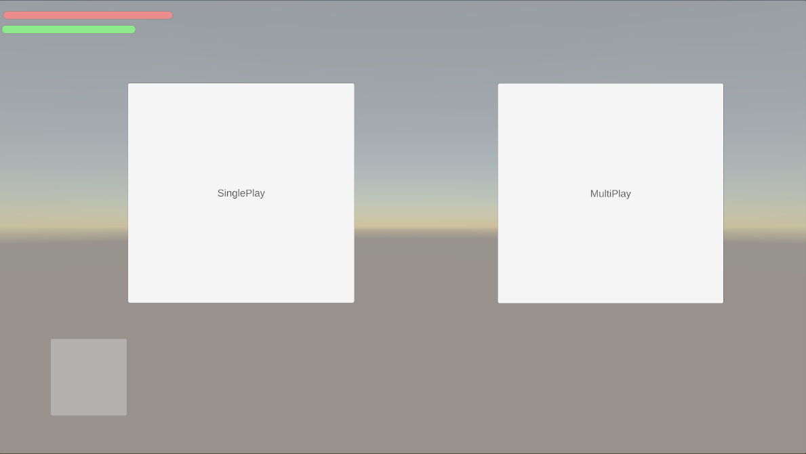

<h1 align="center">DogSoul</h1>

유니티 멀티플레이 액션 RPG 게임

    
    
    
    
    

 

## ➡️[프로젝트 개발에 실제로 사용한 GitHub 주소](https://github.com/KookminCapstoneProject/dogsoul)⬅️

 

## 목차

- [프로젝트 소개](#프로젝트-소개)
- [게임 진행 소개](#게임-진행-소개)
- [게임 구성 요소](#게임-구성-요소)
- [시스템 구조도](#시스템-구조도)
- [설치 및 실행 방법](#설치-및-실행-방법)
- [팀원 소개](#팀원-소개)
- [관련 문서](#관련-문서)

 

## 프로젝트 소개

DogSoul 프로젝트는 소울라이크의 핵심적인 게임 요소를 모두 갖춘 상태에서 멀티플레이와 절차적 맵 생성이라는 요소가 포함된 멀티플레이 ARPG 게임입니다.

게임의 특색을 살릴 수 있도록 캐주얼 그래픽을 선별하여 적은 자원으로 풍부한 경험을 선사할 수 있도록 설계했습니다.

게임의 전투 시스템은 소울라이크 게임과 같이 적에게 공격을 적중시키고, 적의 공격을 회피하는 메커니즘에 집중하여 개발하고자 하였고, 협업이 본 게임만의 차별성으로 매김할 것을 예상하여 시스템을 구축 단계에서 멀티플레이, 공격, 락온, 회피, 사용 아이템의 기능을 반드시 포함할 것을 목표로 삼았습니다.

 

## 게임 진행 소개

맨 처음 게임을 실행하면

새로 계정을 생성합니다.

계정 생성에 성공하면 마을에 플레이어가 생성됩니다.

기본 제공되는 무기 앞에 가서 `Tab` 키를 통해 인벤토리를 열 수 있습니다. 그 후 무기를 드래그 해서 무기 창에 장착합니다.

이제 포탈로 들어가서 던전으로 넘어가봅시다

포탈을 넘게 되면 먼저 싱글 플레이와 멀티 플레이를 선택할 수 있습니다. 예시는 멀티 플레이로 하겠습니다.

멀티플레이 선택 후 방을 생성하고 시작합니다.

던전에 들어왔습니다.

이제 던전을 탐험하며 성장 스토리를 시작합니다.

 

## 게임 구성 요소

| 플레이어         | 설명               |
| ---------------- | ------------------ |
| 기본 움직임      | WSAD 키            |
| 대쉬             | 마우스 우클릭      |
| 몬스터 락온      | 마우스 스크롤 버튼 |
| 인벤토리 및 스탯 | `Tab` 키           |
| 아이템 습득      | `E` 키             |

플레이어는 던전 내부에서 몬스터를 처치하여 골드, 아이템, 경험치를 얻을 수 있습니다.

각 레벨당 필요한 경험치를 모은 다면 인벤토리 창 내부의 스탯 패널에서 레벨업과 스탯 분배가 가능합니다.

 

던전 내부에서 사망할 시 가지고 있던 모든 아이템을 잃어버리게 됨으로 주의가 필요합니다.

 

| 몬스터        | 설명                                               |
| ------------- | -------------------------------------------------- |
| 플레이어 식별 | 몬스터에게 일정 거리 이상 다가가면 플레이어를 인식 |
| 플레이어 추적 | 인식한 플레이어 추적                               |
| 플레이어 공격 | 몬스터마다 고유한 패턴으로 플레이어를 공격         |

> 몬스터 중 하나인 동굴 박쥐

몬스터는 고유한 공격 패턴을 가지고 있으며 공격 대시 시간이 랜던하게 바뀌므로 주의가 필요합니다.

몬스터가 사망할 시 골드와 아이템을 드랍합니다.

플레이어가 몬스터를 타격할 시 나오는 순간의 피격 애니메이션 동안에는 연속으로 공격이 불가합니다.

 

| 마을 시스템 | 설명                             |
| ----------- | -------------------------------- |
| 대장간      | 현재 장착중인 무기의 수리        |
| 상점        | 아이템 구매 및 판매              |
| 창고        | 인벤토리에 보관 중인 아이템 보관 |

 

## 시스템 구조도

  

## 설치 및 실행 방법

실행 파일 다운 : https://drive.google.com/file/d/1C2A2Ffeghx3-8lSktg7XdsAspVluf5Mh/view?usp=drive_link

위 파일을 다운 받아 압축을 푼 후 Capstone.exe파일을 실행
 

## 팀원 소개

<table>
    <tr align="center">
        <td style="min-width: 150px;">
            <a href="https://github.com/maijju">
              
               
              <b>김주안</b>
            </a> 
             
              ****1571
        </td>
        <td style="min-width: 150px;">
            <a href="https://github.com/dup06570">
              
               
              <b>김진수</b>
            </a>
                        
              ****1573
        </td>
        <td style="min-width: 150px;">
            <a href="https://github.com/kjh0work">
              
               
              <b>김재훈 </b>
            </a> 
                        
              ****1570
        </td>
    </tr>
    <tr align="center">
        <td>
            팀장, 클라이언트
        </td>
        <td>
            클라이언트, 서버
        </td>
        <td>
            클라이언트, 벡엔드
        </td>
    </tr>
    <tr align="center">
        <td>
            anzuroid@kookmin.ac.kr
        </td>
        <td>
            dup06570@kookmin.ac.kr
        </td>
        <td>
            rlawogns0513@kookmin.ac.kr
        </td>
    </tr>
</table>

 

## 관련 문서

### [중간 발표 자료](https://drive.google.com/file/d/1Vmv6iBsbB8VlCRFKenB9870GVwMNi2CF/view?usp=drive_link)

### [포스터](https://drive.google.com/file/d/1dOfH-m189FW3eaaC6oxpWvB2z3Og-TL3/view?usp=drive_link)

### [수행 결과 보고서]()
